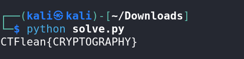

**Name of Challenge:** Tone Dialog
**Points:** 30
**Category:** Cryptography

**Objective:**

In the "Tone Dialog" challenge, you are presented with an audio file. Your goal is to decipher the hidden message within the audio and extract the flag.

**Solution:**

1. Begin by listening to the audio file provided. Upon inspection, you might notice that it sounds like Dual-Tone Multi-Frequency (DTMF) tones. These tones are commonly used in telecommunication systems, and you'll need to decode them.

2. To decode DTMF tones, you can utilize an online tool. One such tool is available at https://dtmf.netlify.app/. This tool can convert DTMF tones into text.

3. Upload the audio file to the DTMF decoder tool. Once you process the audio, it should reveal a sequence of numbers.

4. The obtained sequence may resemble a large integer, but upon closer inspection, you'll find that it doesn't match the format of a typical big integer. Instead, it resembles ASCII characters.

    

5. To decode the ASCII characters, you'll need to convert these numbers into their corresponding ASCII characters. You can do this by comparing the numbers with the ASCII table.

6. Be aware that you may encounter issues if you try to decode the ASCII characters directly from the numbers. Instead, you need to properly space them out to get meaningful text.

7. With the ASCII characters correctly spaced out, you will be able to decipher the hidden message and reveal the flag.

    

**Flag:**

The flag for this challenge is ctflearn{XXXXXXXXXX}. By recognizing and decoding the DTMF tones within the audio file, converting them to ASCII, and properly formatting the text, you will successfully retrieve the flag and complete the "Tone Dialog" challenge.
