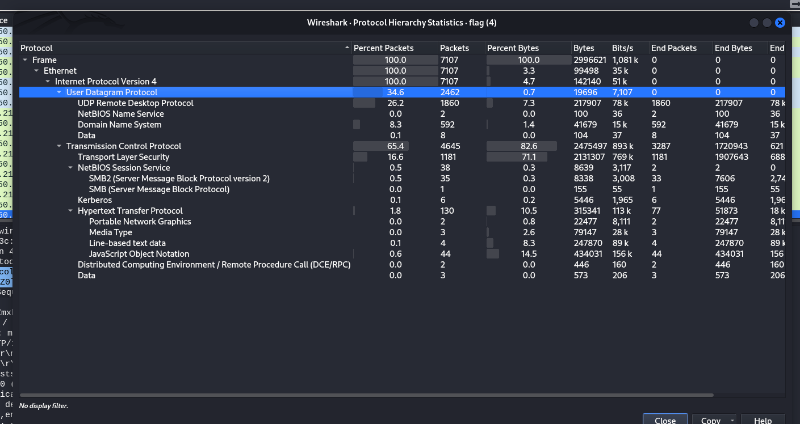

# CTF Challenge Writeup
**Name:** A CAPture of a flag
**Points:** 50
**Category:** Forensics

## Objective

The objective of this challenge is to analyze a network packet capture (PCAP) file to locate a hidden flag.

## Solution

1. **Analyzing the Network Traffic**
   - To solve this challenge, your first step is to analyze the provided PCAP file. PCAP files contain recorded network traffic data.
  

2. **Focusing on TCP Packets**
   - As you inspect the protocols used in the PCAP file, you'll likely observe that TCP (Transmission Control Protocol) packets make up the majority of the data. TCP is a common protocol used for reliable data transmission.

3. **Exploring TCP Packets**
   - With the focus on TCP packets, delve into the details of these packets. Your goal is to uncover any hidden information within the TCP traffic.

4. **Discovering the Suspected HTTP GET Request**
   - During your exploration of the TCP packets, you will eventually come across a suspicious HTTP GET request.

5. **Flag Extraction**
   - Extract the flag from the discovered HTTP GET request. 

## Flag
The flag for the A CAPture of a flag challenge is `CTFlearn{XXXXXXXXXX}`. Replace 'XXXXXXXXXX' with the actual flag you find within the HTTP GET request in the PCAP file.

Congratulations on completing this Forensics challenge! You've demonstrated your skills in analyzing network traffic and identifying hidden information within captured packets.
