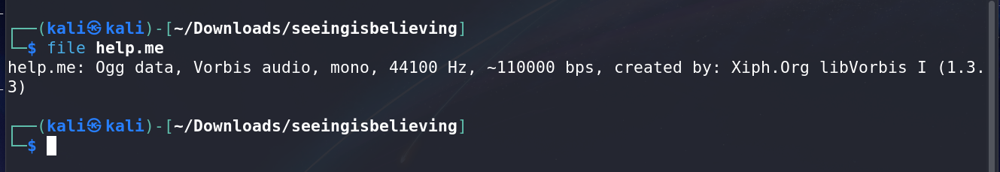
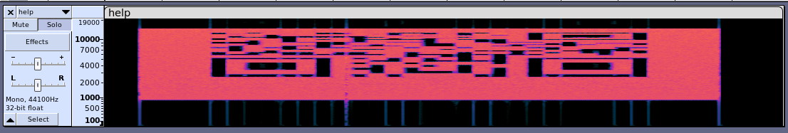
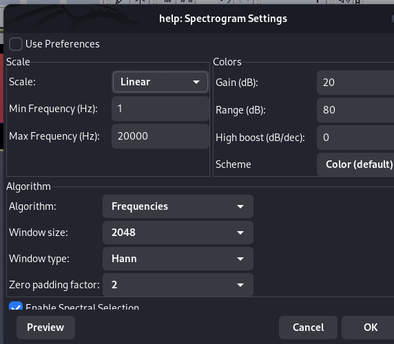

**Name of Challenge:** Seeing is Believing
**Points:** 70
**Category:** Forensics

**Objective:**

In the "Seeing is Believing" challenge, the objective is to extract hidden information from a provided file. Specifically, we need to reveal a QR code hidden within an audio file and decode it to retrieve the flag.

**Solution:**

1. Begin by unzipping the challenge file, which contains a file with the `.me` extension. This file extension hints that it might be related to multimedia.

2. To identify the content of the `.me` file, you can use the `file` command to determine the file type. In this case, it is identified as a music file.

    

3. Since the challenge involves hidden information, it's a good idea to open the audio file with audio processing software. A commonly used tool for this purpose is `Audacity`.

4. After opening the audio file in `Audacity`, switch to the `Spectrogram` view. In the spectrogram view, you may observe unusual patterns that appear as distortions in the audio. These distortions could contain hidden information, such as a QR code.

    
    

5. To make the hidden QR code more visible, switch to `Linear` mode within the spectrogram view. This mode often provides a clearer representation of the hidden patterns.

    

6. Scan and decode the QR code using a QR code reader or an online QR code decoder. The QR code likely contains the flag required to complete the challenge.

    

**Flag:**

The flag for this challenge is in the format ctflearn{XXXXXXXXXX}. By following the steps mentioned above and revealing the hidden QR code within the audio file, you can decode it to retrieve the flag and successfully complete the "Seeing is Believing" challenge.
