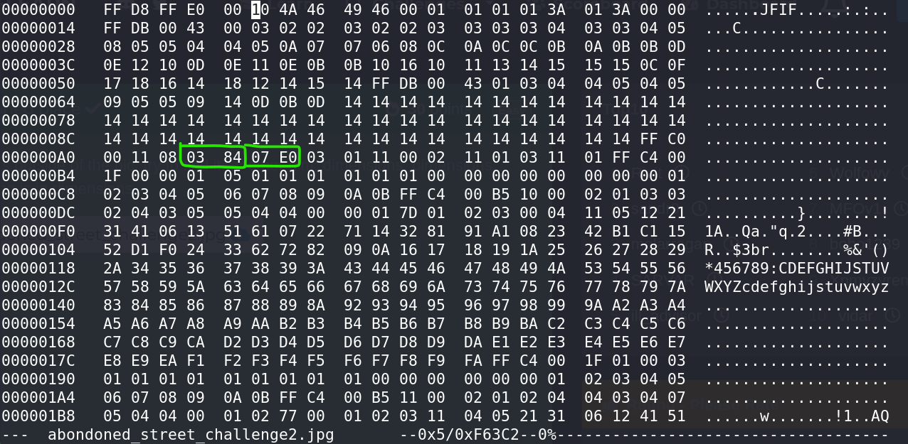

# CTF Challenge Writeup
**Name:** Abandoned Place
**Points:** 30
**Category:** Forensics

## Objective

The objective of the "Abandoned Place" challenge is to extract the hidden flag from an image by modifying the image's dimensions. The hint in the challenge suggests that the flag is located outside of the visible image.

## Solution

1. **Initial Assessment**
   - The challenge tips indicated that the flag exists beyond the borders of the given image. An initial assumption was made that the image provided might be cropped, and the flag could be revealed by expanding its dimensions.

2. **Image Dimension Modification**
   - To explore this theory, the dimensions (height and width) of the image were adjusted.
   - Changing the height and width can be achieved by editing the raw bytes that constitute the image using a tool like ```hexedit```.

3. **Locating Height and Width**
   - One challenge was the randomization of the position of the width and height bytes in the JPEG image's header. It was difficult to identify their positions by comparing with a typical JPEG image file header, so an alternative method was required.

4. **Searching for Byte Patterns**
   - ```hexedit``` was used to search for specific byte patterns within the image file. The search functionality could be accessed by pressing CTRL+S.
   - Using a pattern search, the image's height and width were discovered.
   - With the help of a tool like exiftool, the original image was found to have a height of 900 pixels and a width of 2016 pixels.
     - 900 in hex is \x03\x84
     - 2016 in hex is \x07\xE0


1. **Modifying Image Dimensions**
   - To modify the image's dimensions, the height and width bytes were located using their hex values. In this case, the dimensions were doubled. So, the new image had a height of 1800 pixels and a width of 4032 pixels.

2. **Flag Extraction**
   - Once the image dimensions were successfully modified, the hidden flag outside the original image became visible.

3. **Flag**
   - The flag for the "Abandoned Place" challenge is `flag{XXXXXXXXXX}`. The flag was revealed by expanding the image dimensions and locating the hidden content.

This challenge highlighted the importance of thorough image forensics, including examining image dimensions, header structure, and byte-level analysis to extract concealed information.
