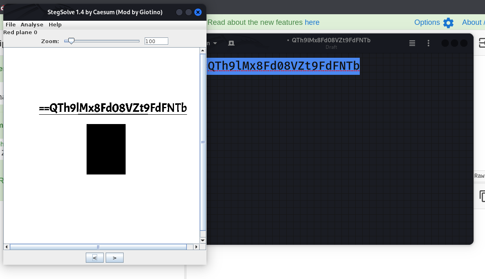
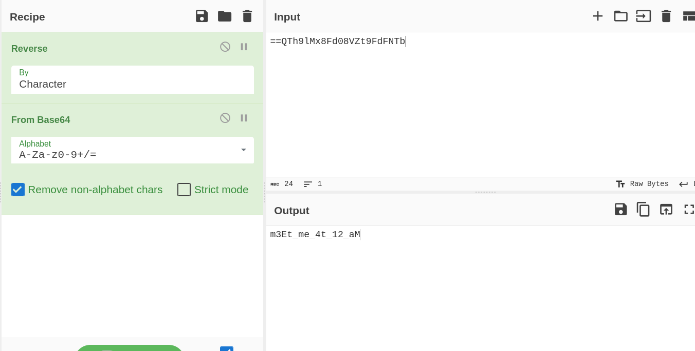

**Name of Challenge:** Ambush Mission
**Points:** 60
**Category:** Miscellaneous

**Objective:**

The "Ambush Mission" challenge provides you with an image file. Your goal is to extract a hidden message from this image, which will lead you to the flag.

**Solution:**

1. Start by performing an initial analysis of the image file. Commonly used tools for this task are `file` and `exiftool`. These tools can reveal important metadata and file information, which might be useful in your investigation.

2. After examining the file with the standard OSINT tools, you might not find any significant information or clues. This could be an indicator that the challenge involves steganography, the art of hiding information within a file.

3. Proceed to use steganography tools such as `steghide` to check if there's any hidden content within the image. Sometimes, challenges hide data using steganographic techniques.

4. If `steghide` doesn't yield any results, it's time to use a specialized steganography tool called `stegsolve`. Stegsolve is known for its ability to uncover hidden messages and patterns within images.

5. Open the image in `stegsolve` and carefully examine it for hidden information or patterns. Sometimes, the challenge creator might use complex color manipulation or other techniques to hide data. You might want to try different color channels and image modes.

6. In `stegsolve`, you find a base64 encoded message, but it appears to be reversed.

    

7. Reverse the base64 encoded message, and you will uncover the flag. 

    

**Flag:**

The flag for this challenge is ctflearn{XXXXXXXXXX}. By utilizing steganography techniques and uncovering the hidden message within the image, you will successfully retrieve the flag and complete the "Ambush Mission."
