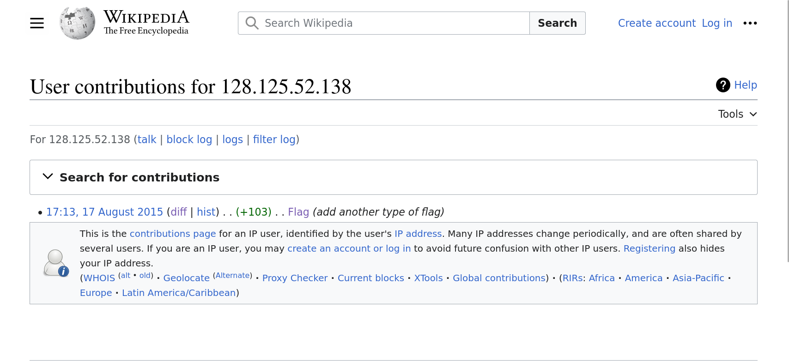
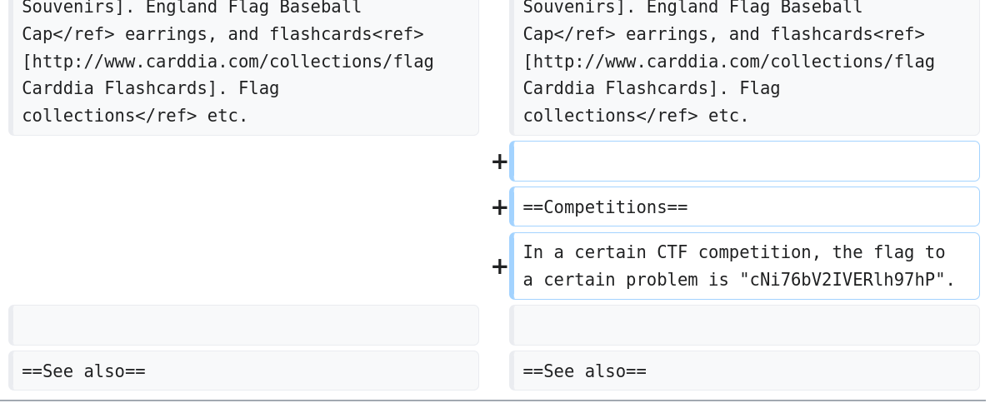

# Wikipedia - CTF Challenge Writeup

## Challenge Information
- **Name**: Wikipedia
- **Points**: 30
- **Category**: Miscellaneous

## Objective
The objective of the "Wikipedia" CTF challenge is to test your investigative and research skills. The challenge description provides a hint related to Wikipedia and supplies an IP address. Your task is to use this information to uncover a hidden flag. This challenge encourages participants to explore and analyze contributions made by a specific IP address on Wikipedia.

## Solution
To successfully complete the "Wikipedia" challenge, I followed these steps:

1. **Analyzing the Challenge Description**:
   - The challenge description explicitly mentions "Wikipedia" and provides an IP address.
   - The hint suggests that the IP address is somehow related to Wikipedia contributions.

2. **Research and Investigation**:
   - I recognized that the key to solving this challenge was to investigate the contributions made by the provided IP address on Wikipedia.
   - To do this, I visited Wikipedia's page history and used the provided IP address to filter contributions by that specific source.

      

3. **Locating the Flag**:
   - By carefully examining the contributions linked to the IP address, I eventually found the hidden flag.

4. **Flag Identification**:
      

By conducting research on Wikipedia contributions made by the specified IP address, I successfully located and extracted the flag.

## Flag
The flag for this challenge is in the format `ctflearn{XXXXXXXXXX}`. Participants should follow the provided steps to investigate and identify contributions linked to the given IP address on Wikipedia in order to reveal the hidden flag.

I hope this writeup assists you in understanding the approach to solving the "Wikipedia" CTF challenge. If you have any more questions or need further assistance, please feel free to ask.
