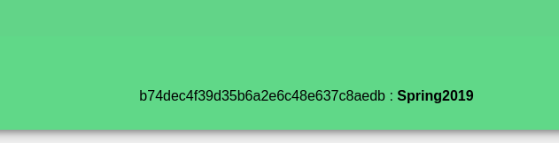

# Basic Android RE 1 - CTF Challenge Writeup

## Challenge Information
- **Name**: Basic Android RE 1
- **Points**: 10
- **Category**: Reverse Engineering

## Objective
The objective of the "Basic Android RE 1" CTF challenge is to introduce participants to the fundamentals of Android Reverse Engineering (RE). In this challenge, you are provided with an APK (Android Application Package) file, and your task is to analyze the code within the app to uncover a hidden flag. This challenge aims to teach the basic principles of decompiling and understanding Android applications.

## Solution
To successfully complete the "Basic Android RE 1" challenge, I followed these steps:

1. **Analyze the APK**:
   - Given an APK file, the first step is to decompile it and inspect the code. For this, I used jadx-gui, a tool that allows you to visualize and explore the decompiled code of Android applications.

2. **Decryption and Flag Construction**:
   - While analyzing the decompiled code, I searched for any relevant code snippets or functions. In this challenge, I found code related to MD5 hash decryption and flag construction.
   - The code likely involved the decryption of an MD5 hash and the construction of the flag from the result.

      

3. **Decrypting the MD5 Hash**:
   - To obtain the flag, you will need to decrypt the MD5 hash.  

4. **Flag Reconstruction**:
   - After successfully decrypting the MD5 hash, I used the obtained text to reconstruct the flag based on the flag format provided in the source code.

      

By following these steps, I was able to reverse engineer the Android application, decrypt the MD5 hash, and reconstruct the flag.

## Flag
The flag for this challenge is in the format `ctflearn{XXXXXXXXXX}`. Participants should use reverse engineering techniques to analyze the APK, decrypt the MD5 hash, and construct the flag as described in the solution.

Please specify the points and category for the challenge to complete the writeup accurately. If you have any more questions or need further assistance, feel free to ask.
